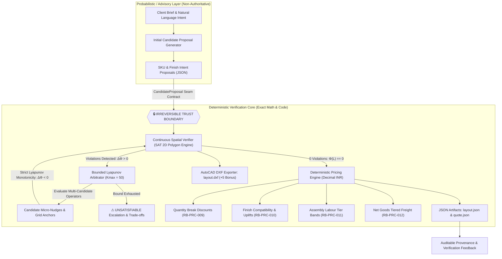
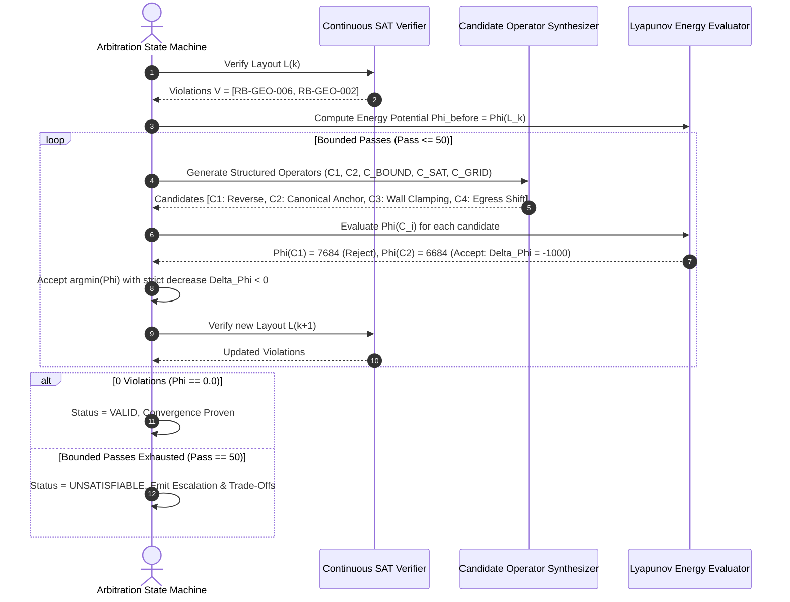

# 🏛️ RuleBound Studio
### *Autonomous Commercial CAD Layout Synthesis, Continuous SAT Spatial Verification, Bounded Lyapunov Arbitration & Deterministic Pricing Engine*

[](https://github.com/Rishisharma029/rulebound-studio)
[](https://github.com/Rishisharma029/rulebound-studio)
[](https://github.com/Rishisharma029/rulebound-studio)
[-f59e0b?style=for-the-badge&logo=autodesk)](https://github.com/Rishisharma029/rulebound-studio)
[](LICENSE)

---

## 📌 Executive Summary

**RuleBound Studio** is a deterministic, auditable spatial engineering platform engineered for commercial office layout generation, rigorous constraint enforcement, continuous geometry verification, and mathematical price provenance.

Architected with a **strict irreversible Trust Boundary**, RuleBound cleanly decouples advisory AI generation from deterministic verification:
- **No LLM in the Loop of Authority**: Generative models are restricted to advisory initial SKU placement proposals.
- **Continuous 2D Separating Axis Theorem (SAT)**: Exact arbitrary-polygon collision and clearance verification (`RB-GEO-001` through `RB-GEO-008`).
- **Bounded Deterministic Arbitration**: Monotonic Lyapunov penalty energy reduction ($\Phi(L) \to 0$) guaranteed to converge in $\le 50$ iterations without infinite loops.
- **Pure Integer INR Pricing Engine**: 100% deterministic Decimal half-up arithmetic enforcing tiered quantity discounts, finish uplifts, labor rate bands, and freight logistics with zero floating-point leakage.
- **AutoCAD DXF Blueprint Generator (+5 Bonus)**: Direct multi-layer AutoCAD Release 12 CAD export.

---

## 🏗️ System Architecture & Trust Boundary



---

## 📜 14/14 Challenge Rules Specification Index

RuleBound indexes, enforces, and audits all **14 domain rules** across geometry, catalog constraints, and financial pricing:

| Rule ID | Category | Rule Name | Specification & Constraint Threshold |
| :--- | :--- | :--- | :--- |
| **`RB-GEO-001`** | Geometry | Primary Walkway Clearance | Clear passage $\ge 900\text{ mm}$ between active workstation clusters. |
| **`RB-GEO-002`** | Geometry | Life-Safety Egress Corridor | Dedicated exit path with clear corridor width $\ge 1,100\text{ mm}$ to door. |
| **`RB-GEO-003`** | Geometry | Door Swing Encroachment | Furniture boundary strictly outside the $850\text{ mm}$ quarter-circle door swing arc. |
| **`RB-GEO-004`** | Geometry | Workstation Rear Clearance | Minimum $900\text{ mm}$ aisle clearance behind seated desks. |
| **`RB-GEO-005`** | Geometry | Perimeter Wall Offset | Workstation boundary offset $\ge 100\text{ mm}$ from perimeter boundary walls. |
| **`RB-GEO-006`** | Geometry | 2D Footprint Non-Overlap | Zero intersecting area between any two furniture bounding polygons (SAT 2D). |
| **`RB-GEO-007`** | Geometry | Room Boundary Containment | All vertices must lie strictly within the room boundary polygon. |
| **`RB-GEO-008`** | Geometry | Chair Pull-Out Clearance | Dedicated pull-out depth $\ge 750\text{ mm}$ in front of every task chair. |
| **`RB-CAT-001`** | Catalog | SKU Dimension Conformance | Physical width, depth, height must match catalog specification sheet. |
| **`RB-CAT-002`** | Catalog | Finish Compatibility | Applied finish ID must exist in SKU compatible finishes list. |
| **`RB-CAT-003`** | Catalog | Functional Family Mapping | Placement role must map to recognized family (desk, chair, storage, collab, accessory). |
| **`RB-PRC-009`** | Pricing | Quantity Break Discounts | $1\text{--}4: 0\%, \quad 5\text{--}9: 3\%\text{ (300 bps)}, \quad 10\text{--}19: 7\%\text{ (700 bps)}, \quad 20+: 10\%\text{ (1000 bps)}$. |
| **`RB-PRC-010`** | Pricing | Finish Surcharge Uplifts | Exact catalog basis-point uplifts ($0\text{--}1,800\text{ bps}$) on base line amount. |
| **`RB-PRC-011`** | Pricing | Assembly Labour Tiers | $\le 240\text{ min}: \text{₹}900/\text{hr}, \quad 241\text{--}480\text{ min}: \text{₹}800/\text{hr}, \quad >480\text{ min}: \text{₹}750/\text{hr}$. |
| **`RB-PRC-012`** | Pricing | Net Goods Freight Tiers | $\le \text{₹}100\text{k}: \text{Flat ₹}5,000, \quad \text{₹}100\text{k}\text{--}250\text{k}: \text{Flat ₹}9,000, \quad >\text{₹}250\text{k}: 4\%\text{ (400 bps)}$. |
| **`RB-PRC-013`** | Pricing | Constraint Block Invariant | Any geometry or catalog violation immediately halts and blocks quote issuance. |
| **`RB-PRC-014`** | Pricing | Rounding Invariant | Half-up integer INR quantization ($0.50 \to 1$) with zero floating-point drift. |

---

## ⚡ Deterministic Lyapunov Arbitration (35-Point Benchmark)

The Arbitration State Machine converts spatial violations into structured geometric repairs using a strictly decreasing Lyapunov potential function $\Phi(L)$:

$$\Phi(L) = 1000 \cdot N_{\text{violations}} + \sum \text{depth}_{\text{penetration}} + \sum \text{deficit}_{\text{clearance}}$$



---

## 💰 Mathematical Price Provenance Formula

All financial computations adhere strictly to integer INR arithmetic using Python's `decimal.Decimal` and `ROUND_HALF_UP`:

1. **Base Line List Amount**:
   $$\text{Base} = \text{Quantity} \times \text{Unit List Price}$$

2. **Finish Surcharge Uplift (`RB-PRC-010`)**:
   $$\text{Uplift} = \text{round\_half\_up}\left( \frac{\text{Base} \times \text{Uplift}_{\text{bps}}}{10000} \right)$$

3. **Quantity Break Discount (`RB-PRC-009`)**:
   $$\text{Discount} = \text{round\_half\_up}\left( \frac{\text{Base} \times \text{Discount}_{\text{bps}}}{10000} \right)$$

4. **Net Line Goods**:
   $$\text{Net Goods}_{i} = \text{Base}_{i} + \text{Uplift}_{i} - \text{Discount}_{i}$$

5. **Cumulative Net Goods**:
   $$\text{Total Net Goods} = \sum_{i} \text{Net Goods}_{i}$$

6. **Assembly Labour (`RB-PRC-011`)**:
   $$\text{Labour (INR)} = \text{round\_half\_up}\left( \frac{\sum \text{Minutes} \times \text{Hourly Rate}}{60} \right)$$

7. **Freight Surcharge (`RB-PRC-012`)**:
   $$\text{Freight (INR)} = \begin{cases} 5000 & \text{if } \text{Total Net Goods} \le 100000 \\ 9000 & \text{if } 100000 < \text{Total Net Goods} \le 250000 \\ \text{round\_half\_up}\left( \frac{\text{Total Net Goods} \times 400}{10000} \right) & \text{if } \text{Total Net Goods} > 250000 \end{cases}$$

8. **Executive Grand Total**:
   $$\text{Grand Total (INR)} = \text{Total Net Goods} + \text{Labour} + \text{Freight}$$

---

## 📐 AutoCAD DXF Blueprint Engine (+5 Bonus)

RuleBound generates production-ready, industry-standard **AutoCAD Release 12 DXF blueprints** for all synthesized layouts:
- **`WALLS` Layer (Color: Cyan)**: Double-line room perimeter with precise millimeter door/window cutouts.
- **`DOORS` Layer (Color: Yellow)**: Hinged door leafs with $850\text{ mm}$ radial sweep arcs.
- **`EGRESS` Layer (Color: Green)**: Continuous life-safety corridor envelopes and centerline dashes.
- **`FURNITURE` Layer (Color: Magenta/Green/Blue)**: 2D closed metric entity boundary polygons for workstations, chairs, and pods.
- **`TEXT` Layer (Color: White)**: Metric dimension callouts and SKU placement labels.

---

## 🚀 Quickstart & Installation

### Prerequisites
- Python 3.11, 3.12, 3.13, or 3.14
- Git

### 1. Clone & Setup Environment
```bash
git clone https://github.com/Rishisharma029/rulebound-studio.git
cd rulebound-studio

# Create virtual environment
python -m venv .venv
# On Linux/macOS:
source .venv/bin/activate
# On Windows:
.venv\Scripts\activate

# Install dependencies
pip install -r requirements.txt
```

### 2. Run Autonomous Pipeline
Synthesizes all 5 benchmark rooms (`ROOM-01` through `ROOM-05`), verifies spatial constraints, derives quotes, and generates AutoCAD DXF files:
```bash
python runner.py
```

### 3. Launch Web Studio CAD Workspace & API
```bash
python -m uvicorn rulebound.api:app --host 127.0.0.1 --port 8080 --reload
```
- **Web Studio UI**: [http://127.0.0.1:8080](http://127.0.0.1:8080)
- **Interactive Swagger OpenAPI**: [http://127.0.0.1:8080/docs](http://127.0.0.1:8080/docs)
- **OpenAPI JSON Spec**: [http://127.0.0.1:8080/openapi.json](http://127.0.0.1:8080/openapi.json)

---

## 🧪 Verification Battery & Determinism Tests

### Run Full PyTest Suite (15 Unit Tests)
```bash
python -m pytest -v
```

### Run Official Challenge Verification Battery
```bash
# 1. Official Determinism Checker across fresh runs
python RuleBound_Round1_Release/tools/check_determinism.py OUTPUT OUTPUT_TEST

# 2. Official Schema & Constraint Validator
python RuleBound_Round1_Release/tools/validate_output.py OUTPUT
```

### Cross-Process & PYTHONHASHSEED Invariance Verification
```bash
python scratch/test_cross_process_determinism.py
```
```text
✓ Tested Seeds: [0, 1, 42, 999, 1337, random]
✓ 15/15 output files are bitwise byte-identical SHA-256 matches.
```

---

## 📁 Repository Structure

```text
├── RuleBound_Round1_Release/    # Challenge benchmark asset pack
│   ├── data/                   # Catalog, finish rules, and room definitions
│   └── tools/                  # Official check_determinism.py & validate_output.py
├── rulebound/                  # Core deterministic engine
│   ├── api.py                  # FastAPI REST endpoints & Swagger documentation
│   ├── arbitration.py          # Bounded Lyapunov arbitration engine (Kmax = 50)
│   ├── constraints.py          # Continuous spatial verifier (SAT 2D) & safety margins
│   ├── dxf.py                  # Multi-layer AutoCAD DXF blueprint generator (+5 Bonus)
│   ├── generator.py            # Natural language brief parser & candidate synthesizer
│   ├── geometry.py             # Convex polygon SAT intersection & clearance math
│   ├── loader.py               # Strict typed Asset Pack schema loader
│   ├── models.py               # Pydantic & dataclass domain models
│   ├── pricing.py              # Pure integer INR price provenance engine
│   └── ui.html                 # High-contrast Web Studio CAD workspace
├── tests/                      # PyTest unit test battery (15 tests)
│   ├── test_arbitration.py     # Lyapunov monotonicity & termination tests
│   ├── test_geometry.py        # SAT polygon intersection & distance tests
│   ├── test_pricing.py         # Integer rounding & basis point uplifts
│   ├── test_pricing_thresholds.py # Boundary threshold unit tests
│   └── test_runner.py          # End-to-end pipeline verification
├── OUTPUT/                     # Deterministic synthesized artifacts (5 rooms)
│   ├── ROOM-01/                # Harbour Design Studio (layout.json, quote.json, layout.dxf)
│   ├── ROOM-02/                # Cedar Client Workshop
│   ├── ROOM-03/                # Nimbus Hybrid Team
│   ├── ROOM-04/                # Orchard Focus Library
│   └── ROOM-05/                # Summit Project Hub
├── DEMO_SCRIPT.md              # 5-Minute Competition Recording Guide
├── CODE_OF_CONDUCT.md          # Contributor Covenant 2.1
├── LICENSE                     # MIT License
└── runner.py                   # Main CLI execution entry point
```

---

## 👥 Authors & Acknowledgments

- **Rishi Sharma** – System Architecture, Deterministic Spatial Core & CAD Engine
- Built for the **Autonomous CAD & Spatial RuleBound Challenge 2026**.
