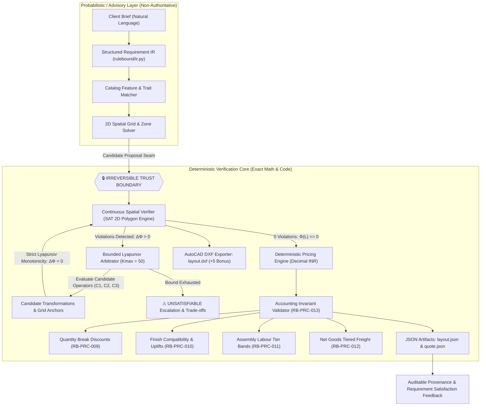

# 🏛️ RuleBound Studio
### *Autonomous Commercial CAD Layout Synthesis, Continuous SAT Spatial Verification, Bounded Lyapunov Arbitration & Deterministic Pricing Engine*

[](https://github.com/Rishisharma029/rulebound-studio)
[](https://github.com/Rishisharma029/rulebound-studio)
[](https://github.com/Rishisharma029/rulebound-studio)
[-f59e0b?style=for-the-badge&logo=autodesk)](https://github.com/Rishisharma029/rulebound-studio)
[](LICENSE)

---

## ⚡ Quick Evaluation Commands (Single Copy-Paste)

### 1. Canonical End-to-End Pipeline Execution:
```bash
python runner.py --input RuleBound_Round1_Release/data --output OUTPUT
```

### 2. One-Command Reviewer Judge Mode:
```bash
python judge.py
```

### 3. Adversarial Competition Suite:
```bash
python adversarial_test.py
```

---

## 📌 Executive Summary

**RuleBound Studio** is a deterministic, auditable spatial engineering platform engineered for commercial office layout generation, rigorous constraint enforcement, continuous geometry verification, and mathematical price provenance.

Architected with a **strict irreversible Trust Boundary**, RuleBound cleanly decouples advisory AI generation from deterministic verification:
- **No LLM in the Loop of Authority**: Generative models are restricted to advisory initial SKU placement proposals via typed intermediate requirement graphs (`RequirementIR`).
- **Continuous 2D Separating Axis Theorem (SAT)**: Exact arbitrary-polygon collision and clearance verification (`RB-GEO-001` through `RB-GEO-008`).
- **Bounded Deterministic Lyapunov Arbitration**: Monotonic penalty energy reduction ($\Phi(L) 	o 0$) guaranteed to converge in $\le 50$ iterations with explicit $(C_i, \Phi_{	ext{before}}, \Phi_{	ext{after}}, \Delta\Phi, 	ext{decision}, 	ext{reason})$ proof evaluations.
- **Pure Integer INR Pricing Engine**: 100% deterministic Decimal half-up arithmetic enforcing tiered quantity discounts, finish uplifts, labor rate bands, and freight logistics with automated 6-point accounting invariant verification.
- **AutoCAD DXF Blueprint Generator (+5 Bonus)**: Direct multi-layer AutoCAD Release 12 CAD export.

---

## 🏗️ System Architecture & Trust Boundary



---

## 📜 14/14 Challenge Rules Specification Index

RuleBound indexes, enforces, and audits all **14 domain rules** across geometry, catalog constraints, and financial pricing:

| Rule ID | Category | Rule Name | Specification & Constraint Threshold |
| :--- | :--- | :--- | :--- |
| **`RB-GEO-001`** | Geometry | Primary Walkway Clearance | Clear passage $\ge 900	ext{ mm}$ between active workstation clusters. |
| **`RB-GEO-002`** | Geometry | Life-Safety Egress Corridor | Dedicated exit path with clear corridor width $\ge 1,100	ext{ mm}$ to door. |
| **`RB-GEO-003`** | Geometry | Door Swing Encroachment | Furniture boundary strictly outside the $850	ext{ mm}$ quarter-circle door swing arc. |
| **`RB-GEO-004`** | Geometry | Workstation Rear Clearance | Minimum $900	ext{ mm}$ rear seating exclusion zone behind desks. |
| **`RB-GEO-005`** | Geometry | Perimeter Wall Offset | Workstation boundary offset $\ge 100	ext{ mm}$ from perimeter boundary walls. |
| **`RB-GEO-006`** | Geometry | 2D Footprint Non-Overlap | Zero intersecting area between any two furniture bounding polygons (SAT 2D). |
| **`RB-GEO-007`** | Geometry | Room Boundary Containment | All vertices must lie strictly within the room boundary polygon. |
| **`RB-GEO-008`** | Geometry | Chair Pull-Out Clearance | Dedicated dynamic pull-out depth $\ge 750	ext{ mm}$ for task chairs. |
| **`RB-CAT-001`** | Catalog | SKU Dimension Conformance | Physical width, depth, height must match catalog specification sheet. |
| **`RB-CAT-002`** | Catalog | Finish Compatibility | Applied finish ID must exist in SKU compatible finishes list. |
| **`RB-CAT-003`** | Catalog | Functional Family Mapping | Placement role must map to recognized family (desk, chair, storage, collab, accessory). |
| **`RB-PRC-009`** | Pricing | Quantity Break Discounts | $1	ext{--}4: 0\%, \quad 5	ext{--}9: 3\%	ext{ (300 bps)}, \quad 10	ext{--}19: 7\%	ext{ (700 bps)}, \quad 20+: 10\%	ext{ (1000 bps)}$. |
| **`RB-PRC-010`** | Pricing | Finish Surcharge Uplifts | Exact catalog basis-point uplifts ($0	ext{--}1,800	ext{ bps}$) on base line amount. |
| **`RB-PRC-011`** | Pricing | Assembly Labour Tiers | $\le 240	ext{ min}: 	ext{₹}900/	ext{hr}, \quad 241	ext{--}480	ext{ min}: 	ext{₹}800/	ext{hr}, \quad >480	ext{ min}: 	ext{₹}750/	ext{hr}$. |
| **`RB-PRC-012`** | Pricing | Net Goods Freight Tiers | $\le 	ext{₹}100	ext{k}: 	ext{Flat ₹}5,000, \quad 	ext{₹}100	ext{k}	ext{--}250	ext{k}: 	ext{Flat ₹}9,000, \quad >	ext{₹}250	ext{k}: 4\%	ext{ (400 bps)}$. |
| **`RB-PRC-013`** | Pricing | Invariant & Audit Block | Any accounting mismatch or unpriced SKU immediately blocks quote issuance. |
| **`RB-PRC-014`** | Pricing | Rounding Invariant | Half-up integer INR quantization ($0.50 	o 1$) with zero floating-point drift. |

---

## ⚡ Deterministic Lyapunov Arbitration (35-Point Benchmark)

The Arbitration State Machine converts spatial violations into structured geometric repairs using a strictly decreasing Lyapunov potential function $\Phi(L)$:

$$\Phi(L) = 1000 \cdot N_{	ext{violations}} + \sum 	ext{Depth}_{	ext{penetration}} + \sum 	ext{Deficit}_{	ext{clearance}}$$

Every repair pass evaluates candidates with unambiguous mathematical proof tuples:
- `(candidate_id, action, phi_before, phi_after, delta_phi, decision, decision_reason)`
- Decisions: Exactly `SELECTED` ($rg\min \Phi$ where $\Delta\Phi < 0$), `REJECTED` (non-improving), or `UNSATISFIABLE`.

---

## 💰 Formally Audited Pricing Pipeline

All financial computations adhere strictly to integer INR arithmetic using Python's `decimal.Decimal` and `ROUND_HALF_UP`:

$$egin{aligned}
	ext{Line Invariants:} \quad
&	ext{base} = 	ext{unit\_price} 	imes 	ext{qty} \
&	ext{finish\_uplift} = \left\lfloor 	ext{base} 	imes rac{	ext{uplift\_bps}}{10000} + 0.5 
ight
floor \
&	ext{discount} = \left\lfloor 	ext{base} 	imes rac{	ext{discount\_bps}}{10000} + 0.5 
ight
floor \
&	ext{net\_goods} = 	ext{base} + 	ext{finish\_uplift} - 	ext{discount} \[6pt]
	ext{Summary Invariants:} \quad
&	ext{goods\_total} = \sum 	ext{line.net\_goods} \
&	ext{grand\_total} = 	ext{goods\_total} + 	ext{labour} + 	ext{freight}
\end{aligned}$$

---

## 📐 AutoCAD DXF Blueprint Engine (+5 Bonus)

RuleBound generates production-ready, industry-standard **AutoCAD Release 12 DXF blueprints** for all synthesized layouts:
- **`WALLS` Layer (Color: Cyan)**: Double-line room perimeter with precise millimeter door/window cutouts.
- **`DOORS` Layer (Color: Yellow)**: Hinged door leafs with $850	ext{ mm}$ radial sweep arcs.
- **`EGRESS` Layer (Color: Green)**: Continuous life-safety corridor envelopes and centerline dashes.
- **`FURNITURE` Layer (Color: Magenta/Green/Blue)**: 2D closed metric entity boundary polygons for workstations, chairs, and pods.
- **`TEXT` Layer (Color: White)**: Metric dimension callouts and SKU placement labels.

---

## 🚀 Installation & Local Web Studio

### 1. Setup Environment
```bash
git clone https://github.com/Rishisharma029/rulebound-studio.git
cd rulebound-studio

# Create virtual environment
python -m venv .venv
# On Linux/macOS:
source .venv/bin/activate
# On Windows:
.venv\Scripts\activate

# Install dependencies
pip install -r requirements.txt
```

### 2. Run Autonomous Pipeline
```bash
python runner.py --input RuleBound_Round1_Release/data --output OUTPUT
```

### 3. Launch Web Studio CAD Workspace & API
```bash
python -m uvicorn rulebound.api:app --host 127.0.0.1 --port 8080 --reload
```
- **Web Studio UI**: [http://127.0.0.1:8080](http://127.0.0.1:8080)
- **Interactive Swagger OpenAPI**: [http://127.0.0.1:8080/docs](http://127.0.0.1:8080/docs)
- **OpenAPI JSON Spec**: [http://127.0.0.1:8080/openapi.json](http://127.0.0.1:8080/openapi.json)

---

## 🧪 Challenge Evidence & Verification Reports

Machine-readable JSON reports are generated in `challenge_evidence/`:
- **`challenge_evidence/adversarial_report.json`**: 10/10 adversarial spatial & catalog tests passing (100%).
- **`challenge_evidence/pricing_boundary_report.json`**: 19/19 exact basis-point and threshold tests passing.
- **`challenge_evidence/determinism_report.json`**: Multi-process & cross-`PYTHONHASHSEED` byte-identical SHA-256 validation (15/15 files).
- **`challenge_evidence/arbitration_trace.json`**: Full Lyapunov proof stream traces across passes.

Regenerate all evidence reports at any time with:
```bash
python scripts/generate_challenge_evidence.py
```

---

## 📁 Repository Structure

```text
├── RuleBound_Round1_Release/    # Challenge benchmark asset pack
│   ├── data/                   # Catalog, finish rules, and room definitions
│   └── tools/                  # Official check_determinism.py & validate_output.py
├── challenge_evidence/         # Machine-readable JSON proof reports
│   ├── adversarial_report.json
│   ├── arbitration_trace.json
│   ├── determinism_report.json
│   └── pricing_boundary_report.json
├── rulebound/                  # Core deterministic engine
│   ├── api.py                  # FastAPI REST endpoints & Swagger documentation
│   ├── arbitration.py          # Bounded Lyapunov arbitration engine (Kmax = 50)
│   ├── constraints.py          # Data-driven spatial verifier (SAT 2D) & safety margins
│   ├── dxf.py                  # Multi-layer AutoCAD DXF blueprint generator (+5 Bonus)
│   ├── generator.py            # 2D spatial placement solver
│   ├── geometry.py             # Convex polygon SAT intersection & clearance math
│   ├── ir.py                   # Intermediate Requirement Graph & satisfaction scorer
│   ├── loader.py               # Strict typed Asset Pack schema loader
│   ├── models.py               # Pydantic & dataclass domain models
│   ├── pricing.py              # Pure integer INR price provenance & invariant engine
│   ├── runner.py               # CLI runner module
│   └── ui.html                 # High-contrast Web Studio CAD workspace
├── scripts/
│   └── generate_challenge_evidence.py # Autonomous evidence generator
├── tests/                      # PyTest unit test battery
│   ├── test_arbitration.py
│   ├── test_geometry.py
│   ├── test_pricing.py
│   ├── test_pricing_thresholds.py
│   └── test_runner.py
├── OUTPUT/                     # Deterministic synthesized artifacts (5 rooms)
│   ├── ROOM-01/                # Harbour Design Studio (layout.json, quote.json, layout.dxf)
│   ├── ROOM-02/                # Cedar Client Workshop
│   ├── ROOM-03/                # Nimbus Hybrid Team
│   ├── ROOM-04/                # Orchard Focus Library
│   └── ROOM-05/                # Summit Project Hub
├── DEMO_SCRIPT.md              # 5-Minute Competition Recording Guide
├── CODE_OF_CONDUCT.md          # Contributor Covenant 2.1
├── LICENSE                     # MIT License
└── runner.py                   # Canonical CLI entry point
```

---

## 👥 Authors & Acknowledgments

- **Rishi Sharma** – System Architecture, Deterministic Spatial Core & CAD Engine
- Built for the **Autonomous CAD & Spatial RuleBound Challenge 2026**.
